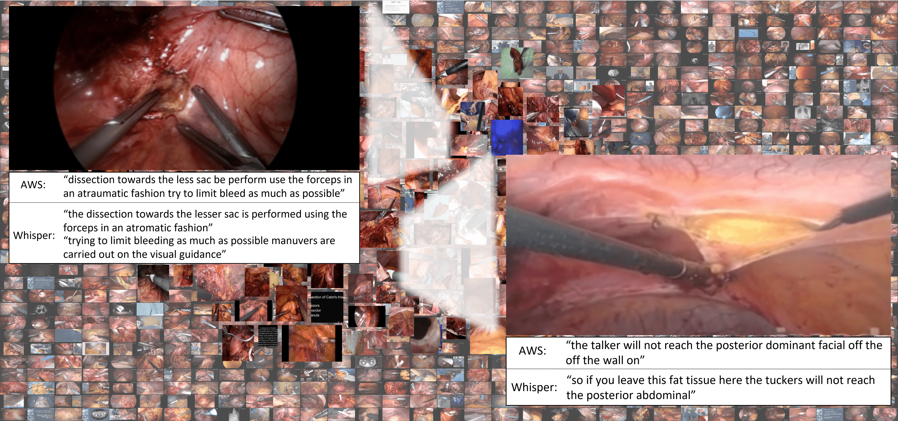

<div align="center">
<a href="http://camma.u-strasbg.fr/">

</a>
</div>

# **Learning Multi-modal Representations by Watching Hundreds of Surgical Video Lectures**
_Kun Yuan, Vinkle Srivastav, Tong Yu, Joel L. Lavanchy, Pietro Mascagni, Nassir Navab, Nicolas Padoy_

[](https://arxiv.org/abs/2307.15220) 

SurgVLP (Surgical Vision Language Pre-training) is a neural network pretrained on large-scale (image, text) pairs from surgical video lectures. It uses automatic speech recognition to generate text transcriptions, addressing the unique linguistic challenges of surgical language and creating an SVL (Surgical Vision-Language Pretraining) dataset. SurgVLP aligns video clip embeddings with corresponding text embeddings in a joint latent space through a contrastive learning objective. Without manual annotations, SurgVLP excels in vision-language tasks like text-based video retrieval, temporal activity grounding, and video captioning. It also demonstrates zero-shot applicability to conventional surgical computer vision tasks, such as phase recognition, without any task-specific finetuning.

## Surgical Vision-Language Pretraining Dataset (SVL)


## Surgical Vision Language Pre-training (SurgVLP)



## Usage

First, create a anaconda environment and [install PyTorch](https://pytorch.org/get-started/locally/) (or later) and torchvision, as well as small additional dependencies, and then install this repo as a Python package. On a CUDA GPU machine, the following will do the trick:

```bash
$ pip install git+https://github.com/openai/CLIP.git
$ pip install git+https://github.com/CAMMA-public/SurgVLP.git
```

```python
import torch
import surgvlp
from PIL import Image
from mmengine.config import Config
device = "cuda" if torch.cuda.is_available() else "cpu"

configs = Config.fromfile('./tests/config.py')['config']
model, preprocess = surgvlp.load(configs.model_config, device=device)

image = preprocess(Image.open("./tests/SurgVLP.png")).unsqueeze(0).to(device)
text = surgvlp.tokenize(['This is preparation phase', 'This is clipcutting phase'], device=device)

with torch.no_grad():
    output_dict = model(image, text , mode='all')

    image_embeddings = output_dict['img_emb']
    text_embeddings= output_dict['text_emb']

    image_embeddings /= image_embeddings.norm(dim=-1, keepdim=True)
    text_embeddings /= text_embeddings.norm(dim=-1, keepdim=True)

    logits_per_image = (100.0 * image_embeddings @ text_embeddings.T).softmax(dim=-1)
    probs = logits_per_image.softmax(dim=-1).cpu().numpy()

print("Label probs:", probs)
```


## API

The SurgVLP module `surgvlp` provides the following methods:

#### `surgvlp.available_models()`

Returns the names of the available pre-trained surgical vision-language models.

#### `surgvlp.load(config, device, download_root)`

Returns the model and the TorchVision transform needed by the model, specified by the model name returned by `surgvlp.available_models()`. It will download the model as necessary. The `name` argument can also be a path to a local checkpoint.

The device to run the model can be optionally specified, and the default is to use the first CUDA device if there is any, otherwise the CPU.

#### `surgvlp.load_dataset(config)`

Returns a torch dataset object given dataset config

#### `surgvlp.tokenize(text: Union[str, List[str]], padding, max_length, truncation, model_name, device)`

Returns a dictionary containing tokenized sequences of given text input(s). This can be used as the input to the model.

---

The model returned by `surgvlp.load()` supports the following methods:

#### `model(image: Tensor, text: None, mode='video')`

Given a batch of images, returns the image features encoded by the vision portion of the SurgVLP model.

#### `model(image: None, text: Tensor, mode='text)`

Given a batch of text tokens, returns the text features encoded by the language portion of the SurgVLP model.

#### `model(image: Tensor, text: Tensor, mode='all')`

Given a batch of images and a batch of text tokens, returns the image and textual embeddings.

## More Examples

### Zero-Shot Surgical Phase Recognition

The code below performs zero-shot phase recognition using SurgVLP. This example takes an image from the Cholec80 dataset testing set, and predicts the most likely phase labels from the dataset. To start with, you need to download the Cholec80 dataset from the offical [website](https://camma.unistra.fr/datasets/) and extract frames. We **recommend** you to download our processed [frames](https://seafile.unistra.fr/f/7d29ecf9ff9d4bad8a0f/?dl=1) and [csv](https://seafile.unistra.fr/f/11a4f6309d8b428f8357/?dl=1) files. 

#### Step 1
Download cholec80 testing set from our S3 server and unzip it into **./tests** folder:
```bash
$ wget --content-disposition https://seafile.unistra.fr/f/11a4f6309d8b428f8357/?dl=1
$ wget --content-disposition https://seafile.unistra.fr/f/7d29ecf9ff9d4bad8a0f/?dl=1
$ unzip csvs.zip -d ./tests/
$ unzip cholec80_test_frames.zip -d ./tests/
```
#### Step 2
Edit the configuration file located at **./tests/config.py** with the your own values:

```python
csv_root='./csvs' # replace with your own value,
video_root='./tmp/' # replace with your own value,
```

#### Step 3 
Run the **tests/zero_shot.py** to conduct zero-shot surgical phase recognition of cholec80 testing set:
```bash
$ cd tests
$ python zero_shot.py --save_plot=False --class_prompt=./class_prompt.txt --config --config=./config.py --batch_size=400
```

## Citing SurgVLP   
Please cite this work if you find it interesting and useful:
```bibtex
@article{yuan2023learning,
  title={Learning Multi-modal Representations by Watching Hundreds of Surgical Video Lectures},
  author={Yuan, Kun and Srivastav, Vinkle and Yu, Tong and Lavanchy, Joel and Mascagni, Pietro and Navab, Nassir and Padoy, Nicolas},
  year={2023},
  eprint={2307.15220},
  archivePrefix={arXiv}
}
```
[[`Download PDF`](https://arxiv.org/pdf/2307.15220.pdf)]


## License
This code, models, and datasets are available for non-commercial scientific research purposes as defined in the [CC BY-NC-SA 4.0](https://creativecommons.org/licenses/by-nc-sa/4.0/). By downloading and using this code you agree to the terms in the [LICENSE](LICENSE). Third-party codes are subject to their respective licenses.

By downloading and using this repo, you agree on these terms and conditions.

## Acknowledgement
This work has received funding from the European Union
(ERC, CompSURG, 101088553). Views and opinions expressed are however those of the authors only and do not
necessarily reflect those of the European Union or the European Research Council. Neither the European Union nor
the granting authority can be held responsible for them. This work was also partially supported by French state funds
managed by the ANR under Grants ANR-20-CHIA-0029-01 and ANR-10-IAHU-02.

